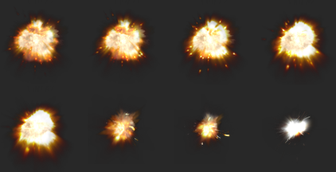
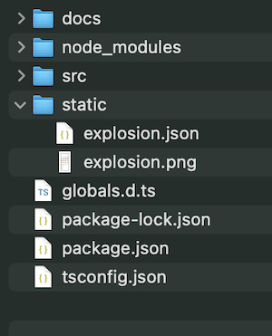
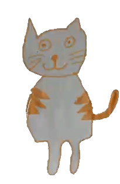

# Spritesheet

[Uitgewerkte code](https://github.com/HR-CMGT/PRG04-pixi-spritesheet-completed)

Een spritesheet is een enkele afbeelding waarin alle frames van een animatie zitten.

[DEMO](https://hr-cmgt.github.io/PRG04-pixi-spritesheet-completed/)



Om spritesheets in te lezen gebruik je een **JSON** file waarin staat welke _bronafbeelding_ je gebruikt en waar de _frames_ zich precies bevinden in die afbeelding.

```json
{
  "frames": {
    "Explosion_Sequence_A 1.png": {
      "frame": {
        "x": 244,
        "y": 1454,
        "w": 240,
        "h": 240
      }
    },
    "Explosion_Sequence_A 2.png": {
      "frame": {
        "x": 244,
        "y": 970,
        "w": 240,
        "h": 240
      }
    }
  },
  "meta": {
    "image": "explosion.png"
  }
}
```

Je kan de [Texture Packer](https://www.codeandweb.com/texturepacker) software gebruiken om van je [losse afbeeldingen](./src/images/cat_animation/) een spritesheet met JSON file te maken.

> _Spritesheets zijn niet alleen handig voor animaties. Je kan het ook gebruiken om alle afbeeldingen uit je game in één enkele PNG file op te slaan. Dit is meer efficiënt qua geheugen van je grafische kaart_.

<br>
<br>
<br>

## Inladen Spritesheet

De [PixiJS Loader](https://pixijs.io/examples/#/sprite/animatedsprite-explosion.js) heeft een speciale functie die herkent dat je een **_spritesheet JSON file_** inlaadt. Je hoeft niet zelf de `PNG` file in te laden. De loader gaat automatisch `textures` uitknippen uit de PNG file.

```typescript
class Game {
  explosionTextures: PIXI.Texture[] = [];

  constructor() {
    this.pixi.loader.add("spritesheet", "explosion.json");
    this.pixi.loader.load(() => this.doneLoading());
  }

  doneLoading() {
    // frames opslaan in een array
    for (let i = 0; i < 26; i++) {
      const texture = PIXI.Texture.from(`Explosion_Sequence_A ${i + 1}.png`);
      this.explosionTextures.push(texture);
    }
  }
}
```

<br>
<br>
<br>

## De animatie tonen

Omdat we de textures in een array hebben opgeslagen, kan je op elk gewenst moment een animatie aanmaken met die textures!

```typescript
class Game {
  createExplosion() {
    const kaboom = new PIXI.AnimatedSprite(this.explosionTextures);
    kaboom.x = 100;
    kaboom.y = 100;
    kaboom.anchor.set(0.5);
    kaboom.play();
    this.pixi.stage.addChild(kaboom);
  }
}
```

<br>
<br>
<br>


## Meerdere animaties in 1 spritesheet

Op basis van de spritesheet kan je meerdere arrays aanmaken waar de verschillende animaties inzitten. 

### Game.ts
```typescript
createCatFrames() {
    // create an array of textures from an image path
    let idleAnimation: PIXI.Texture[] = []
    let jumpAnimation: PIXI.Texture[] = []
    for (let i = 1; i <= 10; i++) {
        // frame 1 tot en met 10 is de idle animation
        idleAnimation.push(PIXI.Texture.from(`poes_${i}.png`))
    }
    for (let i = 11; i <= 30; i++) {
        // frame 11 tot en met 30 is de jump animation
        jumpAnimation.push(PIXI.Texture.from(`poes_${i}.png`))
    }
}
```

<br>
<br>
<br>

### JumpCat.ts

Alle array's (met alle animaties) geef je aan de kat. En de idleAnimation geef je aan de super(). Dit is dan de startanimatie.

```typescript
class JumpCat extends PIXI.AnimatedSprite {
  constructor(idleAnimation: PIXI.Texture[], jumpAnimation: PIXI.Texture[]) {
    super(idleAnimation)
  }
}

let myJumpingCat = new JumpCat(idleAnimation, jumpAnimation)
```


Na een bepaalde actie kan je dan de animatie frames wisselen via `this.textures = ...`:

```typescript
class JumpCat extends PIXI.AnimatedSprite {

  idleAnimation:PIXI.Texture[]
  jumpAnimation:PIXI.Texture[]

  constructor(idleAnimation: PIXI.Texture[], jumpAnimation: PIXI.Texture[]) {
    super(idleAnimation)
    
    this.idleAnimation = idleAnimation
    this.jumpAnimation = jumpAnimation
  }
  
  // als je springt, verander je de frames voor de animatie
  jump(){
    this.textures = jumpAnimation
    this.play()
  }
}

```

<br>
<br>
<br>

## 💀 Live server

De pixi loader werkt niet samen met het `import` statement voor JSON files. Ook is het niet handig dat je live server steeds een andere bestandsnaam aan je spritesheet geeft. Om dit op te lossen gebruiken we een `static` map in het project. Deze map staat **_buiten_** de `src` map.



Je kan deze statische bestanden telkens handmatig in je `docs` map zetten als je je game wil publiceren. Hier is echter ook een plugin voor:

```bash
npm install parcel-reporter-static-files-copy -D
```

Om de plugin te activeren maak je een `.parcelrc` bestand, daarin staat:

```json
{
  "extends": ["@parcel/config-default"],
  "reporters": ["...", "parcel-reporter-static-files-copy"]
}
```

<br>
<br>
<br>

## Completed code

https://github.com/HR-CMGT/PRG04-pixi-spritesheet-completed

<br>
<br>
<br>


## Links

- [ANIMATED DRAWINGS](https://sketch.metademolab.com/): Leuke tool om van een tekening een animatie te maken.
  
- [PixiJS Explosion Example](https://pixijs.io/examples/#/sprite/animatedsprite-explosion.js)
- [Voorbeeldproject met Object Oriented Explosion en .parcelrc bestand](https://github.com/KokoDoko/pixidust/)
- [Texture Packer](https://www.codeandweb.com/texturepacker)
- [Spritesheet files voor Link en Explosion](./spritesheets/)
- [Static folder copy plugin](https://www.npmjs.com/package/parcel-reporter-static-files-copy)
